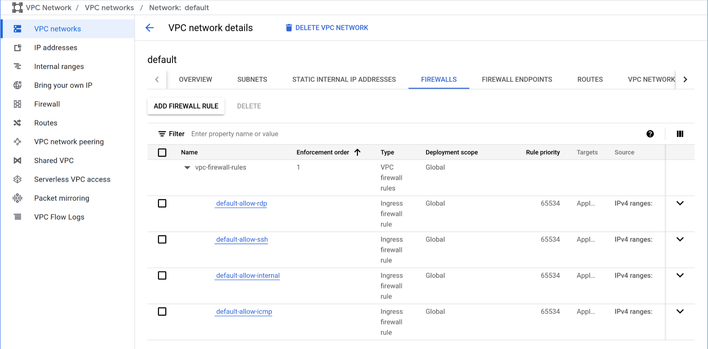
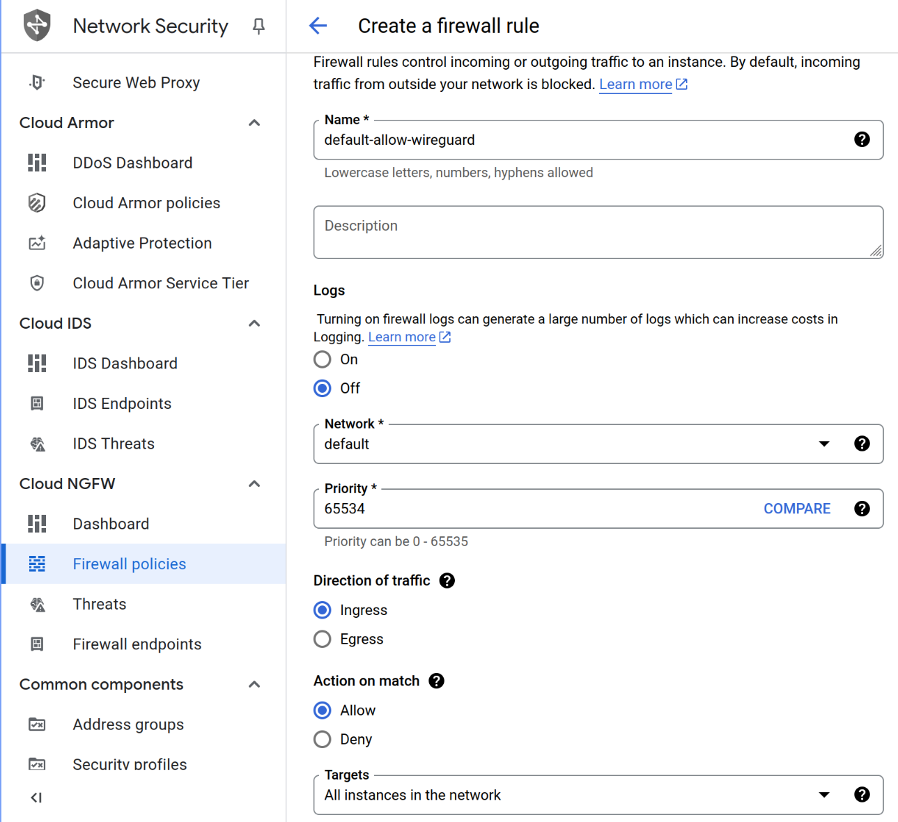
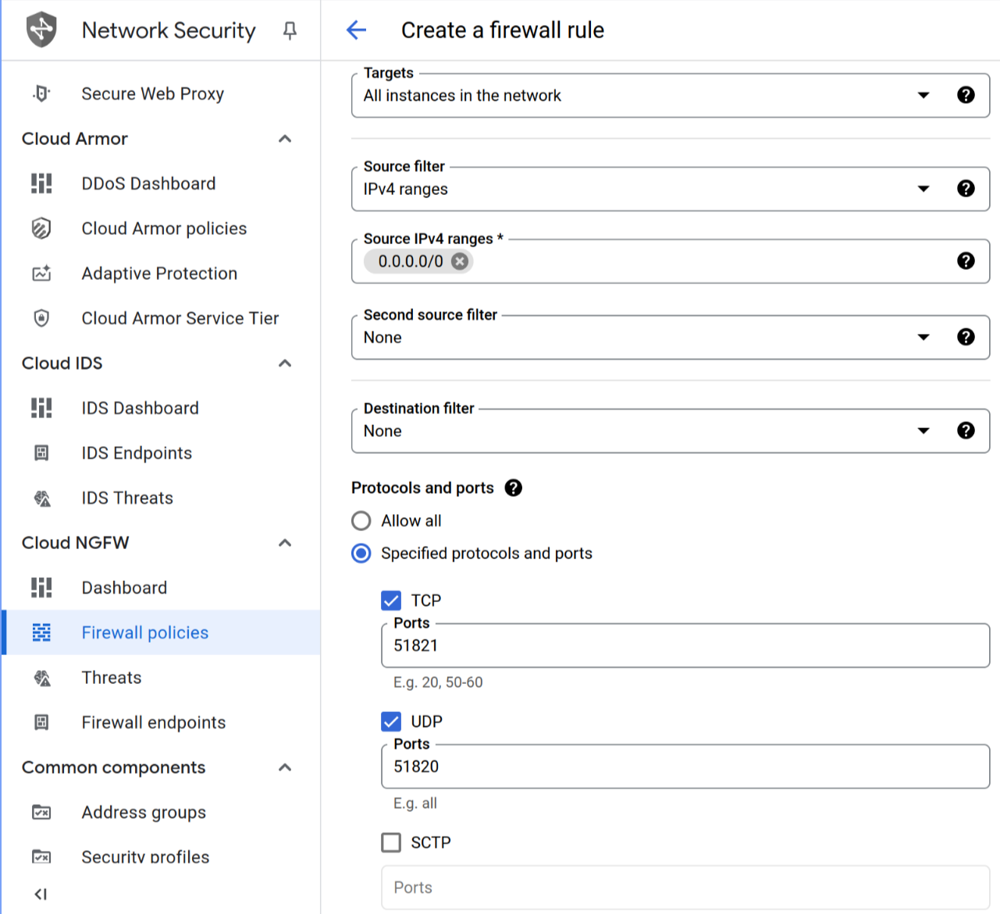
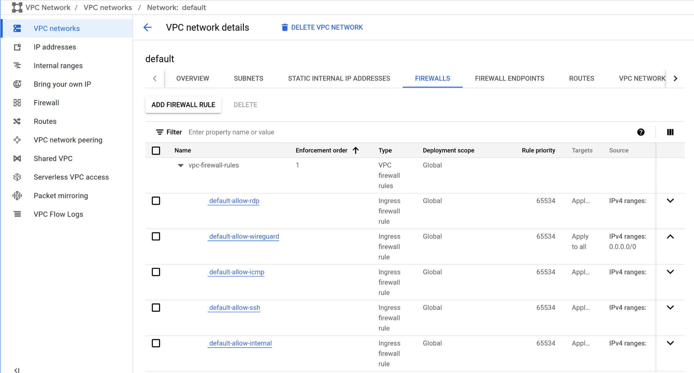
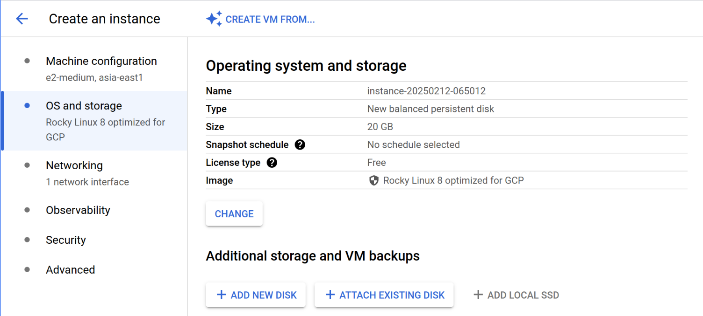
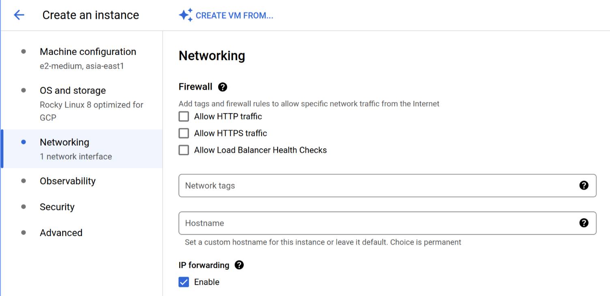
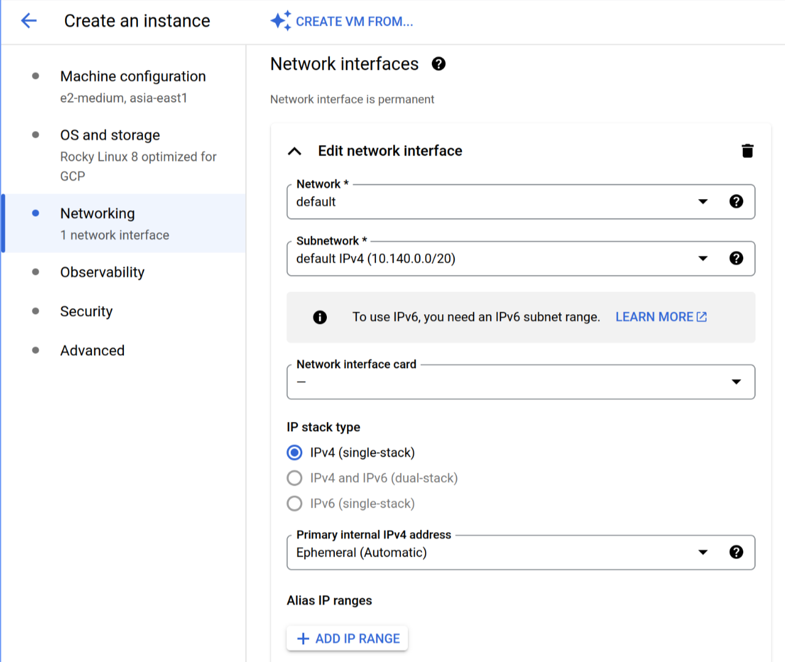
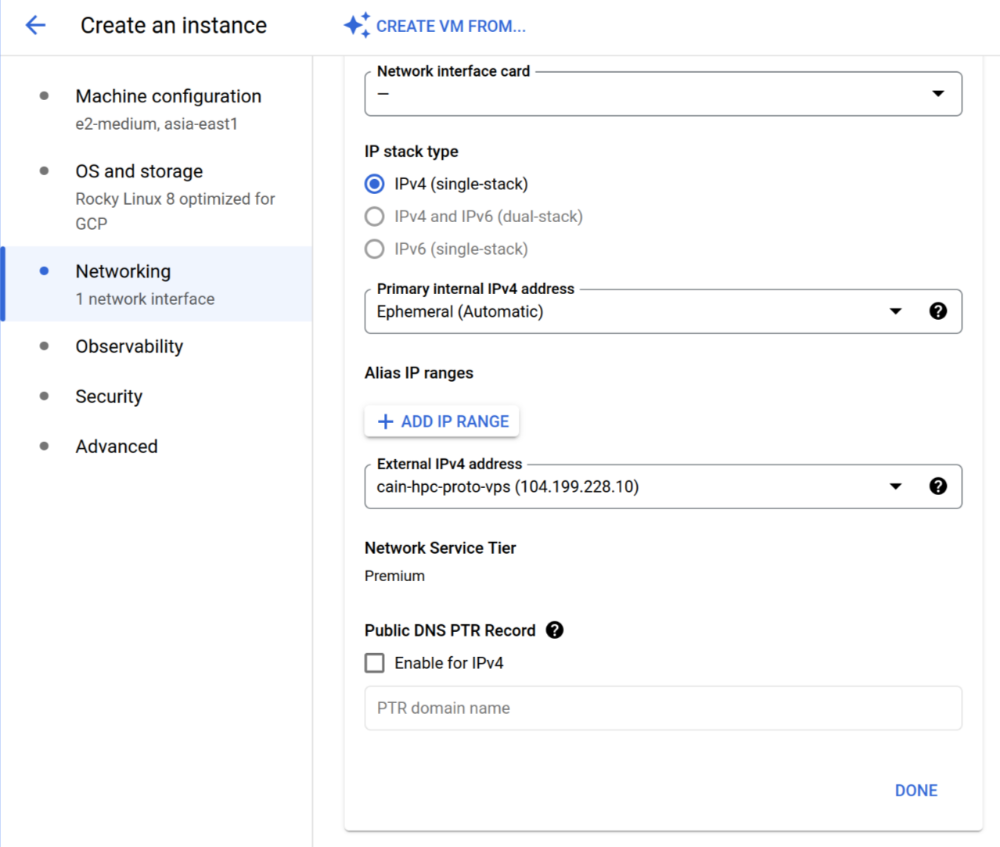
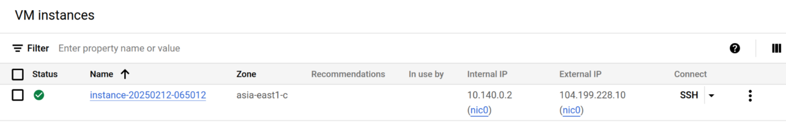

# Remote Access

## Setup a Virtual Private Server (VPS)

To remotely access a server, it must be internet-accessible, typically via a static IP. For servers with dynamic IPs, a dynamic DNS service can map the IP to a hostname. If dynamic DNS isn’t feasible (e.g., due to restricted router access preventing port forwarding), a VPS (e.g., from Google, Linode, Oracle) with a static IP can be used to establish a reverse VPN tunnel, enabling secure remote access.

### Google Cloud

#### Configure VPC Network Firewall

- Go to `Menu` → `VPC networks`, then select the network `default`, and go to the `FIREWALLS`:

  

- Select `ADD FIREWALL RULE` and set the following modifications for wireguard VPN:

  

- Add the UDP port `51820` (wireguard) and the TCP port `51821` (wireguard-gui):

  

- Save and verify the changes:

  

#### Create a VPS Instance

- Set the VPS image (OS) to Rocky Linux 9:

  

- Enable `IP forwarding` in the networking settings:

  

- Edit the network interface, and select the network `default`:

  

- Setup the external IPv4 address (static IPv4 address):

  

- Secure the server, and add your SSH public keys:

  > Disable `secure boot` if you want to avoid additional boot setup after a system upgrade.

  > To list the SSH public keys in your machine, run the command `ssh-add -L`.

  

- Verify the configurations, then create the instance:

  

## Setup Wireguard VPN on VPS Server

Update the system and install `wireguard-tools` and `podman`.

``` sh
sudo dnf config-manager --set-enabled crb
sudo dnf update -y
sudo dnf install -y podman ldns-utils bind-utils

```

Enable and start the `podman` service.

``` sh
sudo systemctl enable --now podman.service
```

Create the file `/etc/modules-load.d/wg-easy.conf` with the following necessary modules:

``` text
ip_tables
iptable_filter
iptable_nat
wireguard
xt_MASQUERADE
```

Define the necessary environment variables for `wg-easy` in `/etc/containers/systemd/wg-easy.env` file. Use `drill` instead of `dig`, if the version is greater than `1.8.0` (see [this](https://github.com/NLnetLabs/ldns/issues/28)) to find the WAN IP address.

``` sh
# WAN (public) IP address or Dynamic DNS hostname (clients will connect to)
SERVER_IP_ADDR="$(dig +short myip.opendns.com @resolver1.opendns.com)"
#SERVER_IP_ADDR="$(drill -Q myip.opendns.com @resolver1.opendns.com)"
printf 'WG_HOST=%s\n' "${SERVER_IP_ADDR}" | sudo tee -a /etc/containers/systemd/wg-easy.env

# Generate password hash
PASSWORD='admin' # change this
sudo podman pull ghcr.io/wgeasy/wg-easy && sudo podman run --rm -it ghcr.io/wg-easy/wg-easy wgpw "${PASSWORD}" | tr -d "[:space:][:cntrl:]'" | sudo tee -a /etc/containers/systemd/wg-easy.env
```

Modify the files `/etc/containers/systemd/wg-easy.container` and `/etc/containers/systemd/wg-easy.volume` with the following contents:

https://github.com/kenrendell/hpc-deploy/blob/626366d0c7eedc579d288a3a90f7790b1b29d171/containers/systemd/wg-easy.volume#L1-L4

https://github.com/kenrendell/hpc-deploy/blob/626366d0c7eedc579d288a3a90f7790b1b29d171/containers/systemd/wg-easy.container#L1-L32

Then, reload systemd and start `wg-easy` service.

``` sh
sudo systemctl daemon-reload
sudo systemctl restart wg-easy.service
```
