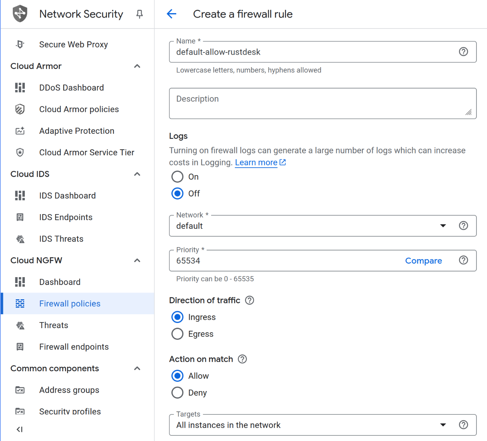
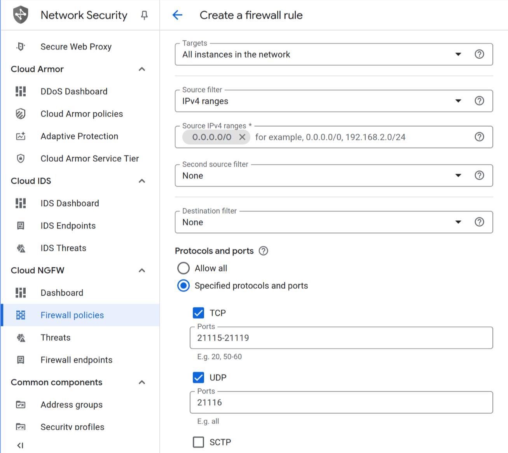
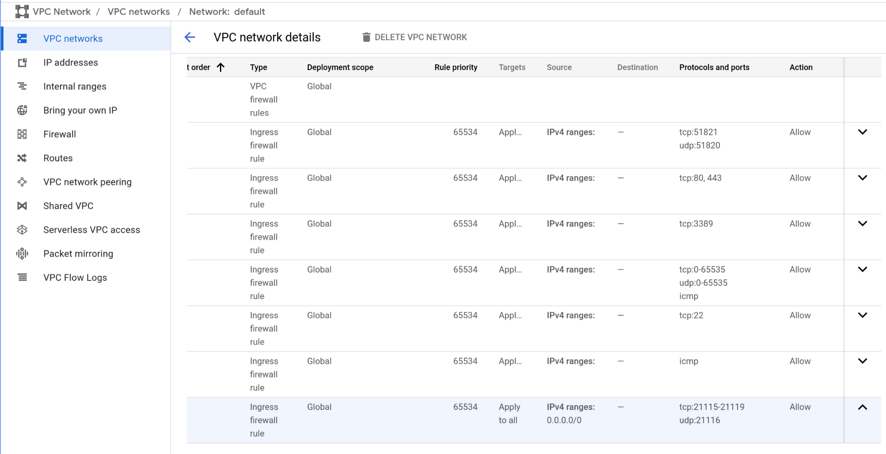

# Remote Access

## Setup a Virtual Private Server (VPS)

To remotely access a server, it must be internet-accessible, typically via a static IP. For servers with dynamic IPs, a dynamic DNS service can map the IP to a hostname. If dynamic DNS isn’t feasible (e.g., due to restricted router access preventing port forwarding), a VPS (e.g., from Google, Linode, Oracle) with a static IP can be used to establish a reverse VPN tunnel, enabling secure remote access.

### Google Cloud

#### Configure Firewall for WireGuard VPN

- Go to `Menu` → `VPC networks`, then select the network `default`, and go to the `FIREWALLS`:

  

- Select `ADD FIREWALL RULE` and set the following modifications for wireguard VPN:

  

- Add the UDP port `51820` (wireguard) and the TCP port `51821` (wireguard-gui):

  

- Save and verify the changes:

  

#### Configure Firewall for RustDesk Server (Optional)

- Go to `Menu` → `VPC networks`, then select the network `default`, and go to the `FIREWALLS`:

  

- Select `ADD FIREWALL RULE` and set the following modifications for RustDesk:

  

- Allow TCP ports `21115-21119` and UDP port `21116` for RustDesk server. See the [port requirements](https://rustdesk.com/docs/en/self-host/rustdesk-server-oss/docker/).

  

- Save and verify the changes:

  

#### Create a VPS Instance

- Set the VPS image (OS) to Rocky Linux 9:

  

- Enable `IP forwarding` in the networking settings:

  

- Edit the network interface, and select the network `default`:

  

- Setup the external IPv4 address (static IPv4 address):

  

- Secure the server, and add your SSH public keys:

  > Disable `secure boot` if you want to avoid additional boot setup after a system upgrade.

  > To list the SSH public keys in your machine, run the command `ssh-add -L`.

  

- Verify the configurations, then create the instance:

  

## Setup Wireguard VPN on VPS Server

Update the system and install `wireguard-tools` and `podman`.

``` sh
sudo dnf config-manager --set-enabled crb
sudo dnf update -y
sudo dnf install -y podman ldns-utils bind-utils httpd-tools
```

Enable and start the `podman` service.

``` sh
sudo systemctl enable --now podman.service
```

Create the file `/etc/modules-load.d/wg-easy.conf` with the following necessary modules:

``` text
ip_tables
iptable_filter
iptable_nat
wireguard
xt_MASQUERADE
```

Restart the VPS Server to load the necessary modules before continuing to the Wireguard GUI setup.

Pull the `wg-easy` image to avoid waiting for systemd process to start.

``` sh
sudo podman pull ghcr.io/wg-easy/wg-easy:nightly
```

Define the necessary environment variables for `wg-easy` in `/etc/containers/systemd/wg-easy.env` file. Use `drill` instead of `dig`, if the version is greater than `1.8.0` (see [this](https://github.com/NLnetLabs/ldns/issues/28)) to find the WAN IP address.

``` sh
sudo rm /etc/containers/systemd/wg-easy.env

# WAN (public) IP address or Dynamic DNS hostname (clients will connect to)
SERVER_IP_ADDR="$(dig +short myip.opendns.com @resolver1.opendns.com)"
#SERVER_IP_ADDR="$(drill -Q myip.opendns.com @resolver1.opendns.com)"
printf 'WG_HOST=%s\n' "${SERVER_IP_ADDR}" | sudo tee -a /etc/containers/systemd/wg-easy.env

# Ethernet device the wireguard traffic should be forwarded through.
INTERFACE='eth0'
printf 'WG_DEVICE=%s\n' "${INTERFACE}" | sudo tee -a /etc/containers/systemd/wg-easy.env

# The MTU the clients will use.
MTU="$(cat "/sys/class/net/${INTERFACE}/mtu")"
printf 'WG_MTU=%s\n' "${MTU}" | sudo tee -a /etc/containers/systemd/wg-easy.env

# Value in seconds to keep the "connection" open. If this value is 0, then connections won't be kept alive.
printf 'WG_PERSISTENT_KEEPALIVE=%s\n' '25' | sudo tee -a /etc/containers/systemd/wg-easy.env

# Allowed IPs clients will use.
printf 'WG_ALLOWED_IPS=%s\n' '10.8.0.0/24' | sudo tee -a /etc/containers/systemd/wg-easy.env

# Enable display and generation of short one time download links (expire after 5 minutes)
printf 'WG_ENABLE_ONE_TIME_LINKS=%s\n' 'true' | sudo tee -a /etc/containers/systemd/wg-easy.env

# The maximum age of Web UI sessions in minutes. 0 means that the session will exist until the browser is closed.
printf 'MAX_AGE=%s\n' '15' | sudo tee -a /etc/containers/systemd/wg-easy.env

# Enable Prometheus metrics http://0.0.0.0:51821/metrics and http://0.0.0.0:51821/metrics/json
printf 'ENABLE_PROMETHEUS_METRICS=%s\n' 'true' | sudo tee -a /etc/containers/systemd/wg-easy.env

# Generate the password hash
PASSWORD='admin' # change this
PASSWORD_HASH="$(sudo podman run --rm -it ghcr.io/wg-easy/wg-easy:nightly wgpw "${PASSWORD}" | tr -d "[:space:][:cntrl:]'" | cut -d '=' -f 2)"

# Set the password hash for WireGuard UI
printf 'PASSWORD_HASH=%s\n' "${PASSWORD_HASH}" | sudo tee -a /etc/containers/systemd/wg-easy.env

# Set the password hash for WireGuard Prometheus metrics
printf 'PROMETHEUS_METRICS_PASSWORD=%s\n' "${PASSWORD_HASH}" | sudo tee -a /etc/containers/systemd/wg-easy.env
```

> To generate bcrypt hash, see [this](https://github.com/wg-easy/wg-easy/blob/master/How_to_generate_an_bcrypt_hash.md). Or use the `htpasswd` command from `httpd-tools` package.

Modify the files `/etc/containers/systemd/wg-easy.container` and `/etc/containers/systemd/wg-easy.volume` with the following contents:

https://github.com/kenrendell/hpc-deploy/blob/626366d0c7eedc579d288a3a90f7790b1b29d171/containers/systemd/wg-easy.volume#L1-L4

https://github.com/kenrendell/hpc-deploy/blob/2236cf2e07896a02cb672e458a14c90c9446d8e1/containers/systemd/wg-easy.container#L1-L32

Then, reload systemd and start `wg-easy` service.

``` sh
sudo systemctl daemon-reload
sudo systemctl restart wg-easy.service
```

### Configure HTTPS

Pull the `caddy` image to avoid waiting for systemd process to start.

``` sh
sudo podman pull docker.io/library/caddy
```

``` sh
sudo systemctl daemon-reload
sudo systemctl restart caddy.service
```

``` sh
SERVER_IP_ADDR="$(dig +short myip.opendns.com @resolver1.opendns.com)"
#SERVER_IP_ADDR="$(drill -Q myip.opendns.com @resolver1.opendns.com)"
printf '\n%s {\n  reverse_proxy wg-easy:51821\n}\n' "${SERVER_IP_ADDR}" | sudo podman exec -i caddy tee -a /etc/caddy/Caddyfile
sudo podman exec caddy systemctl reload caddy
```

Alternatively, edit the `/etc/caddy/Caddyfile` file if you want to change the server's IP address.

``` sh
sudo podman exec -it caddy vi /etc/caddy/Caddyfile
sudo podman exec caddy systemctl reload caddy
```

## Setup RustDesk Server on VPS Server (Optional)

[RustDesk](https://rustdesk.com/) is a remote desktop software that can be used for other administrative tasks that requires GUI. See [this](https://rustdesk.com/docs/en/self-host/rustdesk-server-oss/docker/) for the self-hosted RustDesk setup.

Allow TCP ports `21115-21119` and UDP port `21116` for RustDesk server. See the [port requirements](https://rustdesk.com/docs/en/self-host/rustdesk-server-oss/docker/).

``` sh
ZONE='trusted' # change this, see `firewall-cmd --list-all'
sudo firewall-cmd --permanent --zone="${ZONE}" --add-port=21115-21119/tcp --add-port=21116/udp
sudo firewall-cmd --reload
sudo firewall-cmd --list-all
```

Modify the files `/etc/containers/systemd/rustdesk-id.container`, `/etc/containers/systemd/rustdesk-relay.container`, and `/etc/containers/systemd/rustdesk.volume` with the following contents:

https://github.com/kenrendell/hpc-deploy/blob/02e2f3900493693fd6f80ce39cdf2b9a5376fb69/containers/systemd/rustdesk-id.container#L1-L23

https://github.com/kenrendell/hpc-deploy/blob/02e2f3900493693fd6f80ce39cdf2b9a5376fb69/containers/systemd/rustdesk-relay.container#L1-L23

https://github.com/kenrendell/hpc-deploy/blob/02e2f3900493693fd6f80ce39cdf2b9a5376fb69/containers/systemd/rustdesk.volume#L1-L4

Then, reload systemd and start `rustdesk-id` and `rustdesk-relay` services.

``` sh
sudo systemctl daemon-reload
sudo systemctl restart rustdesk-id.service
sudo systemctl restart rustdesk-relay.service
```

For RustDesk clients, the key can be viewed by the following command:

``` sh
sudo podman volume inspect --format={{.Mountpoint}} systemd-rustdesk | sudo xargs -I @ cat @/id_ed25519.pub | tee ~/rustdesk.key
```

Then, copy the file `~/rustdesk.key` and paste to RustDesk clients.

## Wireguard on the Access Node

Install `wireguard-tools`.

``` sh
sudo dnf install -y elrepo-release epel-release
sudo dnf install -y wireguard-tools
```

Allow UDP port 51820 for wireguard `wg-quick` service.

``` sh
sudo firewall-cmd --permanent --zone=public --add-port=51820/udp
sudo firewall-cmd --reload
sudo firewall-cmd --list-all
```

Enable `systemd-resolved` service.

``` sh
sudo systemctl enable systemd-resolved.service
sudo systemctl restart systemd-resolved.service
```

Add new client named `CAIN-HPC-Proto` in `wg-easy` web GUI and download the WireGuard configuration for that client.

``` sh
cat ~/Downloads/CAIN-HPC-Proto.conf | sudo tee /etc/wireguard/CAIN-HPC-Proto.conf
```

Enable and start the `wg-quick` service of the interface `CAIN-HPC-Proto` to activate the connection.

``` sh
sudo systemctl enable wg-quick@CAIN-HPC-Proto.service
sudo systemctl restart wg-quick@CAIN-HPC-Proto.service
```

Check the connection of the interface `CAIN-HPC-Proto`.

``` sh
sudo wg showconf CAIN-HPC-Proto
sudo wg show CAIN-HPC-Proto
```

Repeat the process for other HPC clients.
